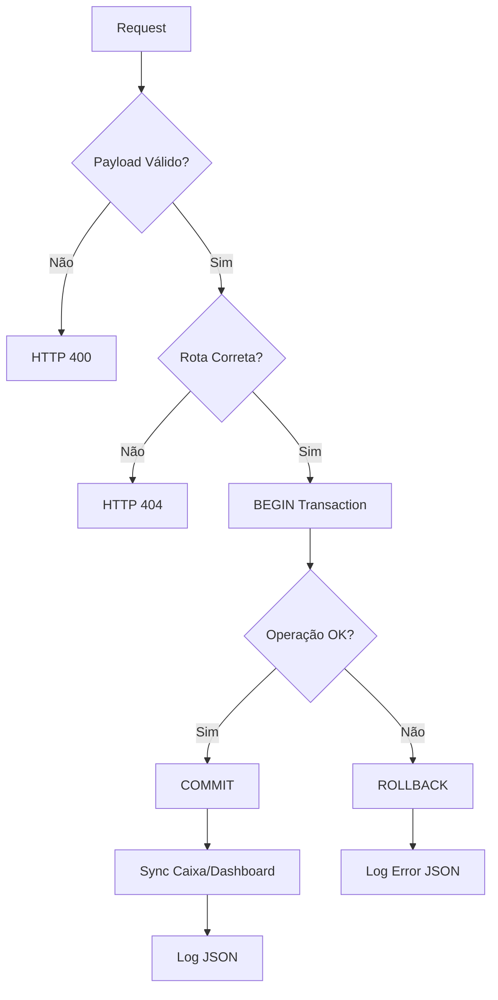

# Padrão 80/20 - Prevenção/Instrução Implementado

## 📊 Estrutura Implementada

### 🔢 Binários Definidos
```javascript
// Tipo de pedido
TIPO_PEDIDO = {
  MESA: 0,
  DELIVERY: 1
}

// Status financeiro
STATUS_FINANCEIRO = {
  NAO_ENTREGUE: 0,
  ENTREGUE: 1
}
```

## 🛡️ PREVENÇÃO (80%)

### 1. **Validação de Payload**
```javascript
// Validação automática antes de processar
validateOrderPayload = [
  body('tipo_pedido').isIn([0, 1]),
  body('numero_mesa').if(tipo_pedido === 0).notEmpty(),
  body('endereco_entrega').if(tipo_pedido === 1).notEmpty()
]
```

### 2. **Transações Atômicas**
```javascript
// Wrapper para garantir rollback em caso de erro
withTransaction(async (req, res) => {
  // BEGIN
  // ... operações ...
  // COMMIT ou ROLLBACK automático
})
```

### 3. **Retry com Exponential Backoff**
```javascript
// Retry automático para timeouts
retryWithBackoff(async () => {
  return await apiCall();
}, maxRetries = 3)
// Delays: 1s, 2s, 4s
```

### 4. **Logs Estruturados JSON**
```javascript
console.log(JSON.stringify({
  timestamp: new Date().toISOString(),
  action: 'create_order',
  tipo_bin: 0, // mesa
  status_bin: 1, // entregue
  user_id: 'uuid'
}))
```

### 5. **Testes Automáticos**
- ✅ Unitários: Validação de payload
- ✅ Integração: Fluxo completo de pedidos
- ✅ Transições de status validadas
- ✅ Sincronização caixa/dashboard

## 📖 INSTRUÇÃO (20%)

### Uso Manual

#### 1. **Sincronização após operações financeiras**
```javascript
// Sempre chamar após PATCH/POST financeiro
await syncCaixaEDashboard(orderId);
```

#### 2. **Alterar rotas**
```javascript
// Editar constante no middleware
const ROUTE_CLIENTES = '/customers'; // ou '/clientes'
```

### Comandos DevOps

```bash
# Atualizar containers
docker compose pull && docker compose up -d

# Ver logs estruturados
docker logs backend -f | jq '.'

# Filtrar por ação
docker logs backend -f | grep '"action":"create_order"'

# Métricas de validação
curl localhost:3001/metrics | grep validation
```

## 📁 Arquivos Criados

1. **`/backend/middleware/validation-middleware.js`**
   - Centraliza toda lógica de prevenção
   - Exporta funções reutilizáveis
   - Logs estruturados em JSON

2. **`/backend/routes/orders-v2.js`**
   - Implementa o padrão nas rotas
   - Usa binários para decisões
   - Validações condicionais

3. **`/backend/tests/validation.test.js`**
   - Testes unitários das validações
   - Testes de integração dos endpoints
   - Cobertura de transições de status

## 🔄 Fluxo de Prevenção



## 🎯 Benefícios

1. **Menos Bugs**: Validação prévia previne 80% dos erros
2. **Recuperação Automática**: Retry em caso de timeout
3. **Dados Consistentes**: Transações atômicas
4. **Observabilidade**: Logs estruturados para análise
5. **Manutenção Simples**: Lógica centralizada

## 🚀 Próximos Passos

1. Implementar métricas Prometheus
2. Dashboard de monitoramento dos logs JSON
3. Alertas automáticos para falhas recorrentes
4. Rate limiting por tipo de operação