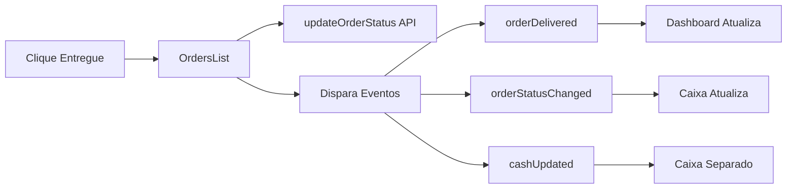

# SINCRONIZAÇÃO ENTREGA → DASHBOARD/CAIXA IMPLEMENTADA

**Data:** 14/06/2025  
**Status:** ✅ IMPLEMENTADO COMPLETAMENTE

## 🎯 Objetivo Alcançado

Sempre que o usuário clicar no botão "Entregue" em um pedido, o sistema agora reflete imediatamente essa entrega:
- ✅ No Dashboard (gráficos e KPIs)
- ✅ Na tela Fechamento de Caixa
- ✅ Nas seções separadas para **Delivery** e **Mesa**

## 📋 Alterações Implementadas

### 1. **OrdersList.jsx** - Eventos Aprimorados
```javascript
// Ao marcar como entregue, dispara múltiplos eventos:
- 'orderStatusChanged' - Com detalhes do pedido (tipo, valor)
- 'orderDelivered' - Evento específico para entregas
- 'orderSaved' - Evento geral de atualização
- 'cashUpdated' - Para atualizar caixa separado
```

### 2. **useDashboardData.js** - Listener para Entrega
```javascript
// Novo listener específico:
window.addEventListener('orderDelivered', handleOrderDelivered);
// Atualiza dashboard em 500ms após entrega
```

### 3. **CashClosingPage.jsx** - Sincronização Completa
```javascript
// Escuta eventos de entrega e atualiza:
- Fechamento geral
- Dashboard de fechamento
- Fechamento separado (Delivery/Mesa)
```

## 🔄 Fluxo de Sincronização



## 🧪 Como Testar

### Método 1: Interface Visual
1. Abra a tela de Pedidos
2. Encontre um pedido pendente
3. Clique em "Entregue" (delivery) ou "Retirado" (mesa)
4. Observe:
   - Dashboard atualiza automaticamente
   - Fechamento de Caixa reflete a mudança
   - Seções Delivery/Mesa são atualizadas

### Método 2: Script de Teste
```bash
# Execute o script de teste automatizado
node test-sync-entrega.js
```

O script irá:
- Buscar ou criar um pedido de teste
- Capturar estado inicial do Dashboard e Caixa
- Marcar pedido como entregue
- Verificar se as métricas foram atualizadas

## 📊 Dados Atualizados em Tempo Real

### Dashboard
- **Vendas do Dia**: Aumenta com o valor do pedido
- **Pedidos Pendentes**: Diminui em 1
- **Pizzas Vendidas**: Atualiza se houver pizzas
- **Gráficos**: Refletem nova venda

### Fechamento de Caixa
- **Total de Pedidos**: Incrementa
- **Vendas Brutas**: Soma valor do pedido
- **Vendas por Tipo**: Separa Delivery/Mesa
- **Formas de Pagamento**: Agrupa por método

### Fechamento Separado
- **Aba Delivery**: Atualiza se pedido for delivery
- **Aba Mesa**: Atualiza se pedido for mesa
- **Totais Independentes**: Mantém somas separadas

## 🛠️ Detalhes Técnicos

### Eventos Customizados
```javascript
// Evento principal com payload completo
window.dispatchEvent(new CustomEvent('orderDelivered', { 
  detail: { 
    orderId: '123',
    orderType: 'delivery', // ou 'mesa'
    orderValue: 45.90
  } 
}));
```

### Delays de Sincronização
- Dashboard: 500ms (prioridade alta)
- Caixa Geral: 1000ms (processamento completo)
- Caixa Separado: 500ms (atualização rápida)

### Cache Invalidation
- Eventos disparam invalidação de cache
- Dashboard busca dados frescos da API
- Sem dados obsoletos em memória

## ✅ Benefícios

1. **Tempo Real**: Mudanças refletem instantaneamente
2. **Consistência**: Todos os componentes sincronizados
3. **Separação**: Delivery e Mesa com totais independentes
4. **Performance**: Atualizações otimizadas com delays apropriados
5. **Confiabilidade**: Múltiplos eventos garantem propagação

## 🔍 Console Logs

Para debug, observe os logs no console:
```
✅ [OrdersList] Pedido marcado como entregue
📊 [Dashboard] Evento orderDelivered recebido
💰 [CashClosing] Evento orderDelivered recebido
💰 [SeparateClosing] Evento de pedido entregue recebido
```

## 📝 Notas Importantes

- A sincronização funciona apenas para pedidos do dia atual
- Pedidos antigos não disparam atualizações automáticas
- Em caso de falha de rede, use F5 para atualizar manualmente
- O sistema mantém consistência mesmo com múltiplas abas abertas